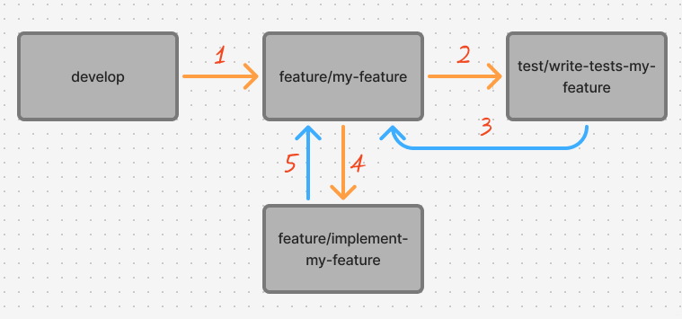
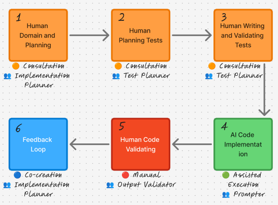

# GAID Manifesto – Guarded AI Development

## 🔤 Nomenclature

**GAID (Guarded AI Development)** can be freely translated as **AI Development with Governance**.  
The name was designed to make it clear that the methodology promotes and encourages the use of Generative AI agents specialized in software development — but only when that use is guided by governance and method.

## 📍 Definition

GAID is a methodology designed to work **with the reality of what many professionals are already doing**: using AI in software development.  
GAID proposes formalizing that use of AI through **human-led test-driven validation (TDD)** and **critical architectural review**.

In short, GAID was created to bring control of software development back to humans using AI — **not the other way around**.

### 🤔 When does it make sense to adopt GAID?

The GAID methodology can be used as a **complement to any team's work method**, as its main focus is formalizing and governing AI usage through TDD-centered validation.However, for GAID to add value without negative effects on your team, consider these points:

1. **The team as a whole already has a well-defined general process**: it could be an agile methodology like Kanban or Scrum, or any other mature and functional method (product, development, quality). This ensures GAID acts like a plugin installed in the team, which can be removed at any time without harm;
2. **There is a habit of software testing**: it's not mandatory to already use TDD, but it's important that the involved developers have good mastery of testing libraries. This reduces the adaptation curve to the methodology, since GAID **is agnostic and leaves technology decisions to the team**;
3. **There is diversity in seniority**: GAID relies on continuous review, so it's important to have **at least one team member with deep knowledge of the business** and tech stack. On the other hand, if there are only highly senior members, GAID may not deliver the expected results. **GAID is best leveraged in diverse teams**, enabling knowledge sharing and continuous learning among developers.

### 🚫 What GAID IS NOT

- GAID is **not** a substitute and/or alternative to agile methodologies (like SCRUM or Kanban). There are no ceremonies, backlog management, or deliveries. GAID acts as a complement to methods already in place in the team;
- **It is not** an architecture framework or implementation pattern, as it does not define architectural structure, language to use, libraries, directory trees, CI/CD tools, etc. GAID does not include the "how to develop," only governance;
- **It is not a "green light" for using any AI model**. Although agnostic, GAID strongly recommends well-defined policies on which AI agents the team should use and how;
- **GAID is not "vibe coding,"** as it rejects any quick software construction proposal without clearly planned behavior. AI accelerates the process, but the vibe owners are still humans;
- **It is not a corporate policy for AI usage norms**, as its focus is exclusively on the software development process and does not replace organizational security and compliance norms regarding AI use.

## 🏛️ The Pillars of GAID

### 1️⃣ Human-First

GAID’s highest priority is to keep humans in control throughout every stage of development.  
Here, AI is only an assistant that takes on operational work.

### 2️⃣ Test-First Always

GAID requires validation through **Test Driven Development (TDD)**.  
Tests are the foundational guide that ensures AI agents create **only what is necessary** — no more, no less — and that the human team reviews and validates the code based on what was defined by humans themselves, not by AI.

### 3️⃣ A Flexible Methodology

GAID defines the overall development flow, from requirements gathering to planning, implementation, and final delivery into production.  
However, it does **not** define how tests must be written, nor which AI agent must be used.

The human team has the freedom and control to decide that for itself and apply GAID on top of those choices.

### 4️⃣ AI Only Writes Code

The AI agent only writes code based on the tests planned by the team and the prompts provided.  
It never makes decisions on its own. Never.

### 5️⃣ Segregation of Duties

The person responsible for implementing code with AI (the **Prompter**) must never be the same person who validates that implementation.

## 🚩 Assisted Autonomy Levels

The use of **Assisted Autonomy Levels** establishes a clear classification of how much AI agents participate throughout the stages of GAID.

- **🔴 Level 0 (Manual):** complete absence of AI agents. Everything must be conceived, planned, and executed by humans.
- **🟠 Level 1 (Consultation):** AI agents may be used as a source of information or research, but the final content and decision must be 100% written by humans.
- **🔵 Level 2 (Co-creation):** AI may generate drafts and suggest changes (code, documentation, tests) under continuous human supervision. Nothing should be transferred directly from the AI agent without first going through human review and reorganization.
- **🟢 Level 3 (Assisted Execution):** the AI agent performs tasks with a high degree of autonomy. Final responsibility still remains under human review, but at this level it is acceptable for a result to be 100% produced by AI, as long as it is properly validated.

## 👥 Roles in GAID

The GAID Functions serve to clarify the responsibilities of each team member during the methodology Stages. Functions can be accumulated, meaning the Test Planner can also be the Output Validator, for example. The exception is the Prompter, who **cannot be the Output Validator**.

GAID Functions should be rotational, so it is recommended that for each new planned implementation, the team rotates previous assignments.

**IMPORTANT**: In the GAID methodology, Functions are used as guides to recommend team assignment and responsibility organization. However, GAID **does not encourage** disruptive changes to the team's culture, such as pre-existing ceremonies and meetings. In other words: when we say, for example, that the Test Planner should participate in Stage 2, this **does not mean that only they will handle the stage**. The golden rule remains: GAID is agnostic and must adapt to the team's current culture.

### Implementation Planner

- Plans and documents implementation requirements according to business rules. Ensures that the team's defined architecture and best practices are followed;
- Acts as protagonist in Stage 1;
- Mandatory presence in Stage 6.

### Test Planner
- Plans and writes test suites and cases for the implementation;
- Acts as protagonist in Stages 2 and 3;
- Mandatory presence in Stages 1 and 6.

### Prompter

- Interacts with AI agents, mainly in the main coding stage of the implementation;
- Acts as protagonist in Stage 4;
- Mandatory presence in Stages 1, 2, and 6.

### Output Validator

- Reviews and validates outputs generated by AI agents (documents, code);
- Must never be the Output Validator;
- Acts as protagonist in Stage 5;
- Mandatory presence in Stages 1, 2, and 6.

## Suggested _Git flow_

This diagram represents the suggested Git Flow for projects adopting GAID, designed to enable isolated work across GAID Stages.

1. Branch feature/{feature_name} branching off from the project's development environment (here called develop). This branch will centralize all Stages and only merge back into develop after all Stages are completed;
2. Branch test/tests-{feature_name} branching off from the centralizing feature/{feature_name} branch. This is where the tests previously planned by the team must be implemented;
3. Branch test/tests-{feature_name} merges back into feature/{feature_name} after tests are written and validated via code review. The test branch can be deleted after this merge;
4. Branch feature/implement-{feature_name} branching off from the centralizing feature/{feature_name}. This is where the general implementation will be done using AI agents;
5. Branch feature/implement-{feature_name} merges back into the centralizing feature/{feature_name} after implementation and validation via code review. The implementation branch can be deleted after this merge;
6. Centralizing branch feature/{feature_name} merges back into develop after all GAID Stages are completed, representing the closure of one methodology cycle.

**IMPORTANT**: Following the guidelines of Pillar 3, GAID is agnostic, so the development team can adapt the branch organization flow to their specific needs.

## GAID Flow

### 1. Human Domain and Technical Planning

**Assisted Autonomy Level**: 🟠 Level 1 (Consultation)

**Protagonist:** Implementation Planner

**Who is involved?**  
Implementation Planner, Test Planner, Prompter and Output Validator.

**Stage goals**
- Ensure the entire team understands:
  - the objective (**what**) of the implementation
  - the justification (**why**) of the implementation
  - the relevance of the implementation and how it positively impacts the business as a whole
- Define software requirements (functional and non-functional)
- Plan and document the implementation architecture, which is essential for developers to later write prompts for AI
- Use the Adversarial Review concept for the planned requirements.

**Definition of Done for Stage 1**  
The team should consider the Human Domain and Technical Planning stage complete when:
- everyone is able to understand the objective, justification, and relevance of the proposed implementation
- there is a list of clear requirements that all developers can understand
- the necessary GAID roles for the implementation have been defined
- Adversarial Review was used
- the proposed architecture is documented and understood by everyone

### 2. Human Test Planning

**Assisted Autonomy Level**: 🟠 Level 1 (Consultation)

**Protagonist:** Test Planner

**Who is involved?**  
Test Planner.

**Stage goals**
- Plan the test suites that will be created, considering possible scenarios and test cases
- Consider the main usage scenarios, alternative paths, and edge cases of the application

**Definition of Done for Stage 2**  
The team should consider the Human Test Planning stage complete when:
- all architecture planned in Stage 1 has properly planned test cases
- the test suites and planned test cases are documented so they can be used in the writing and review stages;
- the written tests were validated by others team members.

### 3. Human Test Writing and Validation

**Assisted Autonomy Level**: 🟠 Level 1 (Consultation)

**Protagonist:** Test Planner

**Who is involved?**  
Test Planner

**Stage goals**
- Write the tests planned in the previous stage, using the libraries and architecture defined by the team
- Validate the written tests through code review, based on what was planned

**Definition of Done for Stage 3**  
The team should consider the Human Test Writing and Validation stage complete when:
- the tests previously planned in Stage 3 have been developed and organized in the repository according to the team’s standard architecture
- the tests have been validated through the team’s code review process

### 4. AI Code Implementation

**Assisted Autonomy Level**: 🟢 Level 3 (Assisted Execution)

**Protagonist:** Prompter

**Who is involved?**  
Prompter

**Stage goals**
- Carry out the main implementation work (coding) for the requested change
- Use an AI agent for coding, with the previously planned and written tests acting as the rules
- Refactor and reorganize the code generated by the AI agent when necessary
- Test the final implementation and send it for team review

**Definition of Done for Stage 4**  
The team should consider the AI Code Implementation stage complete when:
- all previously planned and written tests pass successfully after the AI implementation
- the human developer(s) reviewed and, when necessary, refined the code generated by the AI to meet the team’s standards for best practices and architecture
- the final implementation works in a test environment and meets the acceptance criteria defined by the business team
- a Pull Request has been created and documented in a way that allows code review by the team

### 5. Human Code Validation

**Assisted Autonomy Level**: 🔴 Level 0 (Manual)

**Protagonist:** Output Validator

**Who is involved?**  
Output Validator and Implementation Planner.

**Stage goals**
- Review all code generated by the AI agent
- Ensure compliance with the project’s architectural standards
- Request and apply final adjustments to the implementation whenever necessary

**Definition of Done for Stage 5**  
The team should consider the Human Code Validation stage complete when:
- all code created by the AI agent under the monitoring of developers has been reviewed by the team’s technical owners
- the code entering the main repository follows the project’s existing standards for architecture, best practices, and performance
- the final implementation works and meets the acceptance criteria defined by the business team

### 6. Feedback Loop

The Feedback Loop stage exists to handle possible changes and/or bugs after the initial development process.  
In short, this stage ensures that the new need is properly understood and that the team is routed back to **Stage 2** to handle the case.

**Assisted Autonomy Level**: 🔵 Level 2 (Co-creation)

**Protagonist:** Implementation Planner

**Who is involved?**  
Implementation Planner

**Stage goals**
- Properly direct any changes and/or bugs that arise after the initial development
- Ensure the circular nature of the GAID process, where every repository iteration is properly governed
- use AI to locally reproduce bugs, summerize and technical description of documents and to investigate the root problem

**Definition of Done for Stage 6**  
The team should consider the Feedback Loop stage complete when:
- after a change request or bug report is registered, the technical team understands what needs to be changed
- once the change is understood, the team starts handling it again from **Stage 2** of GAID
